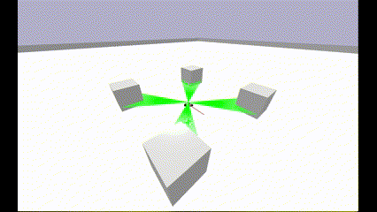

# AGV ENVIRONMENT

<p align='center'>

</p>

To be able to run this environment, you must first install [pybullet](https://pybullet.org/wordpress/), by simply running:

```
!pip install pybullet
```

This is an environment written for implementing Reinforcement Learning algorithms on AGV robots for AGV robot project at I.U.D lab in HCMUT. The environment is written on `gymnasium.Env` class for implementing Reinforcement Learning Agents environments. Which implement all API methods of a basic `gymnasium` environment.

```
env = AGV_env.AGV_env()
while True:
    obs, reward, terminated, truncated, info = env.step(np.array([.5,.5]))
    if terminated or truncated:
        print(terminated,truncated)
        obs, info = env.reset()
```

|                   |                                                                                               |
|-------------------|-----------------------------------------------------------------------------------------------|
| Action Space      | `Box([-1. -1.], [1. 1.], (2,), float32)`                                                      |
| Observation Space | `Box([-1 -1 -3.4028235e+38 -3.4028235e+38 0 ... 0], [1 1 3.4028235e+38 3.4028235e+38 1 ... 1 ], (504,), float32)`  |
| import            | `AGV_env`

## Description

This environment consist of a four-wheeled AGV robot with RPLIDAR module. Despite having four wheels, only two variables is needed, velocity for left wheels and velocity for right wheels.

## Action Space

The action is a `ndarray` with shape `(2,)`, which can take values `{-1,1}`.
| Num   | Action                    | Min   | Max   |
|-|-|-|-|
| 0     | velocity of left wheels   | -1    | 1     |
| 1     | velocity of left wheels   | -1    | 1     |

## Observation Space

The observation is a `ndarray` with shape `(504,)` with the values listed in the table below:

| Num   | Action                                                                | Min               | Max           |
|-|-|-|-|
| 0     | x axis component of a vector points to the target in robot coordinate | -1                | 1             |
| 1     | y axis component of a vector points to the target in robot coordinate | -1                | 1             |
| 2     | x axis component of velocity vector in robot coordinate               | -3.4028235e+38    | 3.4028235e+38 |
| 3     | y axis component of velocity vector in robot coordinate               | -3.4028235e+38    | -3.4028235e+38|
| 4     | RPLIDAR hit fraction along ray number 1                               | 0                 | 1             |
| ...   | ...                                                                   | ...               | ...           |
| 503   | RPLIDAR hit fraction along ray number 500                             | 0                 | 1             |

## Rewards

The reward for this environment has not been decided.

## Episode End

The episode ends if any one of the following occurs:
1. Termination: Distance from the robot center to an object is smaller than `termdis=0.25(m)`.
2. Truncation: Episode length is greater than `max_length =500`.