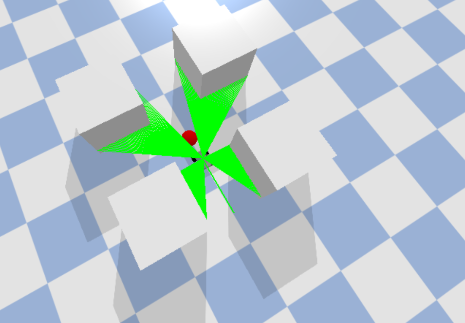

# AGV ENVIRONMENT

This is an environment written for implementing Reinforcement Learning algorithms on AGV robots

To be able to run this environment, you must first install [pybullet](https://pybullet.org/wordpress/), by simply running:
```
!pip install pybullet
```
*** 

